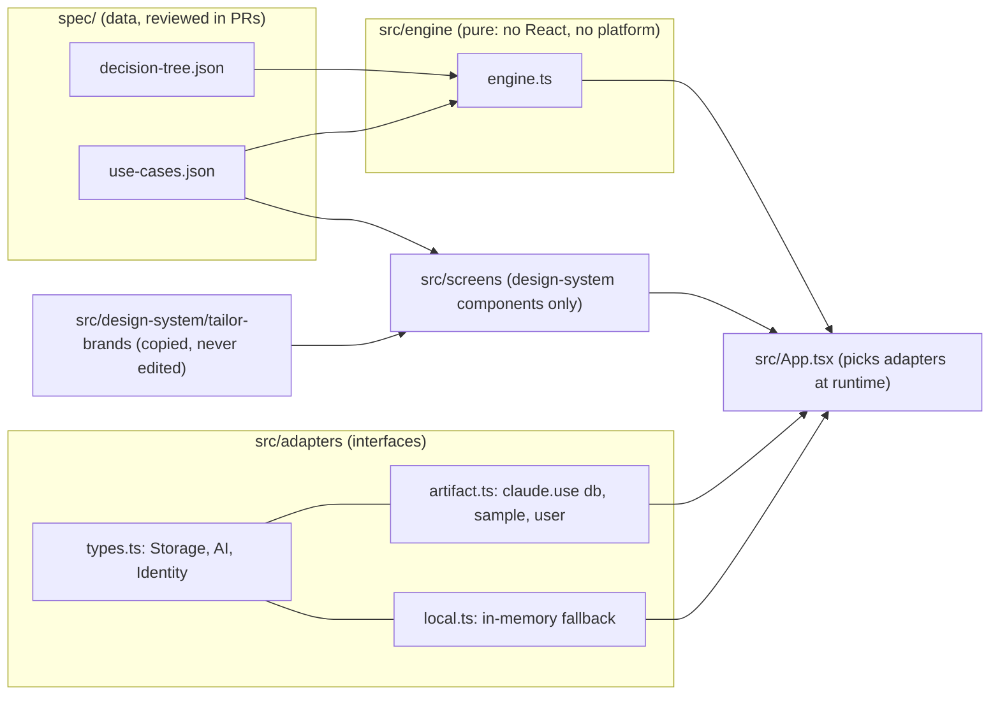

# Brand starter flow (proof of concept)

A decision-tree flow defined as **data**, walked by a **pure TypeScript engine**, rendered with the Tailor Brands design system, and run as a claude.ai Artifact. Platform services (storage, AI, identity) sit behind adapters, so the same engine and screens can run on another platform later.

This is a personal project. All flow copy is example content. The design system lives in its own repo and stays content-free: flows, logic and copy only ever go here.

**Published Artifact:** https://claude.ai/artifact/HxCNdNGXvSD9Z5E6riNAbj (private to the owner until shared; always republish to this same URL)

## Architecture



```
spec/          decision-tree.json · use-cases.json
src/engine/    types.ts · engine.ts · engine.test.ts
src/adapters/  types.ts · artifact.ts · local.ts
src/screens/   Frame · QuestionScreen · OutcomeScreen · ScenarioPicker · CapabilityPanel
src/App.tsx    renders at once with local adapters; Artifact capabilities replace them as they resolve
```

**Graceful degradation.** The flow needs no capability. With none (a viewer outside the organization, a public link, a local `npm run dev`) it uses the keyword rule for the AI step and keeps the session in memory, and the outcome screen says so. `db` + `user` add private saved sessions, `sample` adds the AI classification. The "What this view supports" panel shows which adapters are live.

**Privacy.** Sessions are written to the collection `data/users/<user id>/sessions/items`, one document per session, under the `data/users/` prefix that the `db` capability keeps private to each person. (The shorter `data/users/<id>/sessions/<id>` is a collection path by segment count, not a document.)

## Commands

```bash
npm ci               # Node 22
npm run dev          # local, with the in-memory adapters
npm run typecheck && npm test && npm run build   # run before every push; CI runs the same
npm run ds:sync      # re-copy the design system
npm run artifact:build   # dist/ ready to publish
```

## Change the tree

Edit `spec/decision-tree.json`. Nodes are `question` (kind `single`, `multi` or `text`, with `edges`) or `outcome` (plan, price, 2-3 items, reason). Edges are tried in order; the first whose `when` matches wins, and the last edge of every question must have no `when`.

Conditions are a small typed language, no `eval`:

```json
{ "op": "equals",   "answer": "stage", "value": "idea" }
{ "op": "includes", "answer": "needs", "value": "website" }
{ "op": "all", "of": [ ...conditions ] }
{ "op": "any", "of": [ ...conditions ] }
```

`answer` is a question id, or `<id>.category` for a text question that has a `classify` block (the AI step: its `categories` enum, keyword lists for the fallback, and a `fallback` category). The engine validates the tree on load and rejects unknown node ids, unreachable nodes, leaves without an outcome, conditions on unknown answers or values, operators that do not fit the answer kind, and a missing fallback edge. Run `npm test` after any change.

## Add a use case

Append to `spec/use-cases.json`:

```json
{ "id": "…", "persona": "…", "answers": { "stage": "…", "needs": ["…"], "describe": "…" },
  "aiCategory": "optional: the category the AI step would return",
  "expectedPath": ["stage", "needs", "describe", "outcome-…"], "expectedOutcome": "outcome-…" }
```

`engine.test.ts` runs every scenario (injecting `aiCategory`, or the keyword rule when it is absent, so tests never call `sample`) and checks that every outcome is covered. The same file feeds the scenario picker in the UI, which can open any scenario at any step with its answers pre-filled.

## Sync the design system

`npm run ds:sync` copies `src/` from `Moragron/tailor-brands-design-system` into `src/design-system/tailor-brands/` (minus `main.tsx`, `App.tsx`, `pages/`, `tokens/`, `patterns/`, `*.stories.tsx`) and records the source commit in `src/design-system/tailor-brands/SOURCE.md`. It looks for the clone at `../tailor-brands-design-system`, `../moragron/tailor-brands-design-system`, `$DS_PATH` or a path argument. Never edit the copied files; change the design system in its own repo and sync again. The Tailwind 4 entry is `src/index.css`.

## Publish

1. `npm run typecheck && npm test && npm run build`, commit and push.
2. `npm run artifact:build` (Vite with `base: './'`, an `index.html` reduced to title, CSS/JS tags and root element, and a version/branch/commit stamp).
3. Publish `dist/index.html` with its `dist/assets/*` as one Artifact with `capabilities: {db: {}, user: {}, sample: {}}`. Republish to the same URL every time (record it at the top of this file).

See `docs/FINDINGS.md` for what was observed on the platform.
